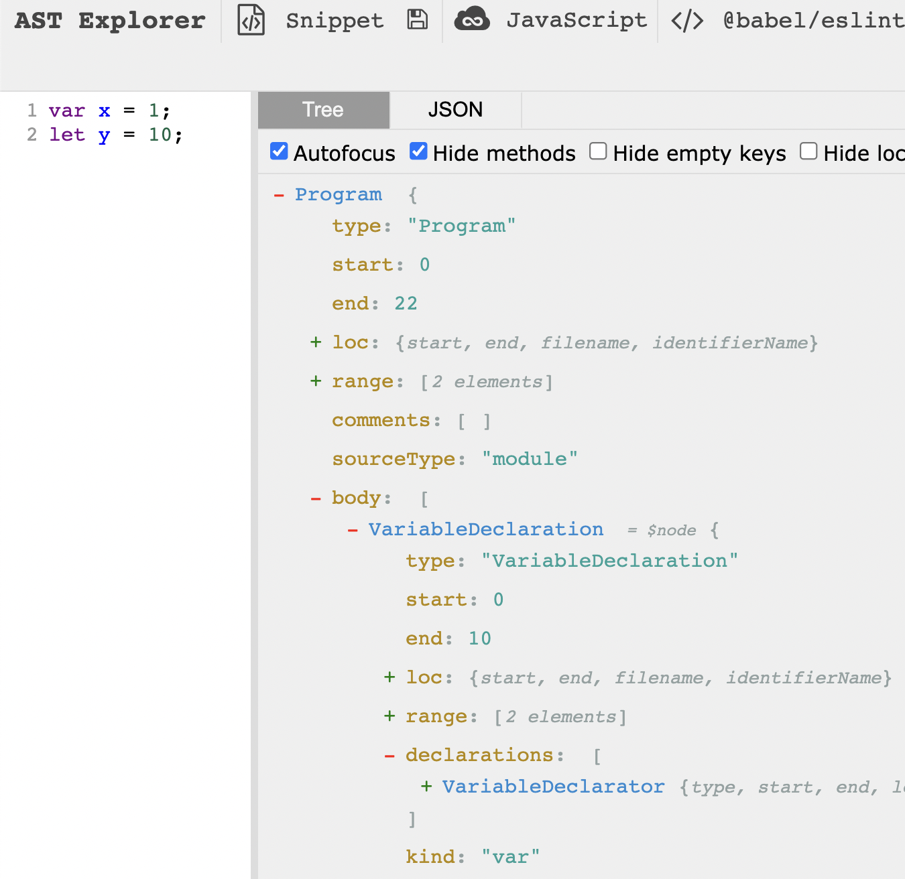
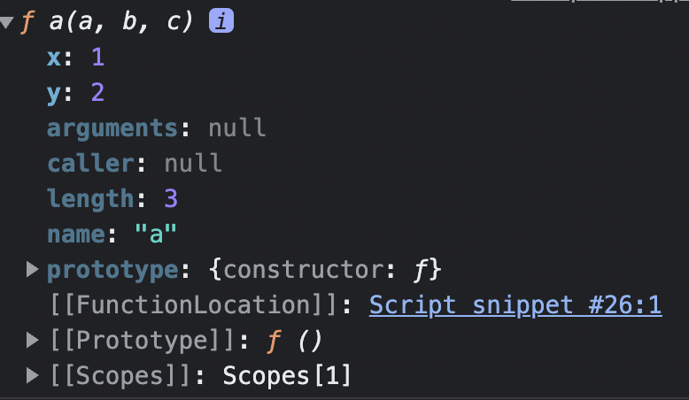

# 20220816 TIL

- for문이 코딩 스킬의 80% 이상이다.

## 렉시컬

렉시컬의 의미는 신경쓰지 않아도 된다.

렉시컬 스코프는 자바스크립트의 전유물이 아니라 대부분의 프로그래밍 언어가 쓴다.

Perl이라는 언어는 동적 스코프를 따른다.

## 상위 스코프를 기억해야 하는 이유

`식별자 결정`을 위해서.

변수의 선언은 식별자의 존재를 자바스크립트 엔진에게 알리는 것이다.

변수를 선언하는 이유는 참조할 식별자가 있는지 없는지 알아야 되므로.

## 스코프는 자료구조다

스코프는 개념적인 것이 아닌, 자료구조다.

단방향 링크드 리스트로 이루어진 자료구조다.

양방향이면 참조하면서 무한루프에 빠진다.

## 함수 이름의 존재 이유

- 재귀 호출을 위해
- 함수 몸체 내에서 디버깅 하기 위해

## 호출 연산자

아래 코드에서 ()는 호출 연산자다. 연산자는 피연산자가 필요하다. 식별자 bar가 피연산자다.

()를 보고 내부슬롯 [[Call]]이 호출되는데 이 때 피연산자 bar가 함수 객체로 평가되었어야 호출이 제대로 된다.

bar가 함수 객체로 평가되지 않았다면 호출 연산을 함수가 아닌 식별자로 했으므로 TypeError가 발생한다.

```jsx
bar();
```

## 함수 객체는 한 번만 평가한다

런타임 이전에 함수 객체를 평가하고, 함수 몸체를 다시 보는 것은 함수를 호출했을 때다.

함수 객체 내부에서 에러가 발생하고 있더라도 호출 전까지는 상관없다.

```jsx
function foo() {
  return x + 1; // 여기서 에러 발생하지 않는다.
}

foo(); // 이 때 함수 몸체로 들어가서 레퍼런스 에러가 발생한다.
```

## 스코프는 짧을수록 좋다

변수는 빨리 죽어야 에러를 발생시킬 시간적 여유조차 없다. 메모리 공간도 오래 잡아먹지 않는다.

스코프가 짧으면 그만큼 변수의 생명주기도 짧다.

## 런타임 이전은 여러번 있다

- 전역 코드가 실행되기 이전
- 함수가 호출되어 함수 몸체를 읽기 이전
  이 때도 자바스크립트 엔진이 함수 내부의 선언문들을 등록한다.

## 호출된 함수는 현재 실행중인 실행 컨텍스트에서부터 찾는다

## 상위 스코프는 함수 객체가 생성될 때 결정된다

전역 스코프에 함수 객체가 등록될 때, 함수 객체는 자신의 상위 스코프인 전역 스코프를 알고 있다.

이 상위 스코프에 대한 정보는 함수 객체의 내부 슬롯 `[[Environment]]`에 등록된다.

[[Environment]]는 프로퍼티 키로 보면 되고, 이 키의 값은 상위 스코프의 함수 객체에 대한 참조값이다.

## 자바스크립트 엔진이 런타임 이전에 코드를 읽는 과정

1. 서버로부터 파일을 패킷 단위로 받아온다.
2. 받아온 소스코드를 2진수로 변환한다.
   js 엔진이 실행하기 전 단계의 코드를 소스코드라고 한다. 읽기 전이므로 그냥 문자열로 이루어진 것으로 판단한다.
3. 파싱(해석) → 컴퓨터가 코드를 읽음
   (프로그래밍 언어 → 인터프리터 → 기계어)
4. AST (Abstract Syntax Tree) 생성

아래가 생성된 AST이다.

자바스크립트 엔진은 `AST를 기반으로 소스코드를 평가`한다.

블록스코프 내에 var 키워드로 선언한 변수와 let, const 키워드로 선언한 변수가 있다면 소스코드 평가단계에서 다 구분해서 식별자 등록을 한다.



## 객체 지향에 대한 미신

1. 객체 지향은 무조건 좋다.
2. 상속은 매우 유용하다.

하지만 자바스크립트에서는 객체지향적으로 프로그래밍 하는건 ... (나중에 알려줌)

## 프로퍼티 어트리뷰트

내부 슬롯은 ECMAScript에 internal slot이라 적혀있는 정식 사양이다.

내부 슬롯은 객체가 가질 수 있다.

16~18장은 프로토타입 설명을 위한 밑밥을 까는 단계이다.

프로퍼티 어트리뷰트를 실제로 커스터마이징 할 일이 있느냐고 묻는다면 그다지 많지 않다.

## arguments 객체

함수 객체의 arguments 프로퍼티는 ES3에서 폐지되었다. 폐지되었다는 건 지금도 존재하긴 하지만 사용하지 말라는 의미이다. 하지만 하위 호완성을 위해 남겨뒀다. 따로 선언하지 않고 함수 내부에서 바로 쓸 수 있는 암묵적인 식별자같은 개념이다. 화살표 함수가 아닌 함수만 가능하다.

arguments 객체는 유사배열 객체이다. 유사배열 객체는

1. length 프로퍼티를 가지고 있다.
2. 프로퍼티 키가 0, 1, 2, … 처럼 인덱스를 닮은 ‘문자열'이다.

```jsx
안쓰는 옛날방법. 변수도 많이써야되고 가독성 떨어짐
const sum = function () {
	let res = 0;
	for (let i = 0; i < arguments.length; i++) {
		res += arguments[i];
	}
	return res;
}

ES6 이후 방법. 변수도 안 쓰꼬 가독성도 좋다.
const sum = function (...args) {
	return args.reduce((p, c) => p + c, 0);
}
```

## console은 ECMAScript 사양이 아니다.

console 객체는 빌트인 객체가 아닌 호스트 객체이다. 브라우저에서 만든 객체이다.

ECMAScript에서 만든 객체가 아니라서 브라우저와 노드 환경에서 다르게 출력된다. 브라우저가 더 유익한 정보를 제공해준다.

## enumerable 값에따라 프로퍼티 색깔이 다르다.

enumerable이 true인 프로퍼티와 false인 프로퍼티는 서로 색깔이 다르다.

열거 가능한, 일반적으로 직접 정의한 프로퍼티는 밝은 색을 띄고, 열거 불가능한, (직접 참조는 가능하다) 프로퍼티는 어두운 색을 띈다.

```jsx
function a(a, b, c) {}
a.x = 1;
a.y = 2;

console.dir(a);
```

## 상속 받은 프로퍼티들은 모두 [[Prototype]]에 담겨있다.



## 순회 vs 열거

[1, 2, 3]이라는 배열을 for문으로 도는건 ‘순회'라고 한다.

`순회`는 ‘순서'가 있다는 것이 중요하고 `열거`는 ‘순서'에 의미가 없다.

배열은 순서에 의미가 있으므로 순회라고 하고, 객체는 순서에 의미가 없으므로 열거라고 한다.

객체는 이름에 의미가 있고, 배열에는 이름이 없다.

배열은 인덱스고, 객체는 이름이 의미가 있는 프로퍼티 키를 가진다.

## 열거

열거되는 프로퍼티는 enumerable이 true인 경우이다.

false인 callee, length같은 프로퍼티는 나오지 않는다.

## 열거를 못하게 하는 이유

열거를 못하게 하는 이유는 우리가 알아도 의미가 없기 때문이다.

불필요한 프로퍼티들을 열거하면 엔진은 불필요한 일을 하게 된다.

## 유사 배열 객체

유사 배열 객체는 설계 미스라고 판단된다.

특히나 ES6부터 `Rest 파라미터`가 나오면서 유사 배열 객체의 의미는 더욱 퇴색되었다.

배열보다 객체가 나은 점은 메서드를 자유자재로 넣을 수 있다는 것인데, 필요한 대부분의 메서드는 배열 메서드로 해결이 가능하다.

배열 메서드로 대부분의 필요한 순회가 가능하므로, 순회 가능한 유사 배열 객체는 쓸 일이 많이 없다.

화살표 함수에서는 arguments 객체가 아예 없는데, 가변 인자 함수는 Rest 파라미터를 사용하면 된다.

## 생성자 함수를 쓰는 이유

생성자 함수는 프로퍼티 구조가 동일한 객체를 여러 개 생성할 때 유리하다는 것이 유일한 이유이다.

## 할당과 바인딩

식별자와 값을 이어주는 개념으로, 거의 비슷한 의미이다.

하지만 this는 바인딩한다고 하지 할당한다고 하지 않는다.

## 태도

되면 왜 되는지 말할 수 있어야 하고, 안되면 왜 안 되는지 말할 수 있어야 한다.

좋은 코드인지 안 좋은 코드인지, 그 이유는 무엇인지 말할 수 있어야 한다.

## 생성자 함수의 단점

생성자 함수는 인스턴스를 여러 개 찍어내는 만큼 메서드 또한 여러 번 생성된다.

생성자 함수가 호출될 때마다 함수 객체(메서드)가 만들어진다.

이는 곧 `메모리의 낭비`로 이어지고 `시간 복잡도와 공간 복잡도` 측면에서 모두 좋지 않다.

## 프로토타입의 등장

프로토타입은 메서드를 한 번만 만들면서 모든 인스턴스가 사용할 수 있도록 `메서드를 상속(공유)`해준다. 이를 통해 생성자 함수의 단점을 극복할 수 있다.

하지만 상속이 꼭 정답은 아니다. 메서드가 계속 생성되는 것을 방지하기 위해서는 매개변수로 함수를 넘겨주는 방법도 있다.

## 상속이 필요한 이유

상속은 `재사용`을 위해서 사용한다.

상속은 인스턴스들의 부모 즉, 프로토타입이 해준다.

## 상속은 스코프 체인과 비슷하다

상속은 상위에 있는 것들을 하위에 있는 것들이 쓸 수 있는 것이다.

상위에 있는 녀석이 하위에 있는 녀석을 쓸 수 없다. 이는 스코프 체인의 개념과 비슷하다.

## 프로토타입의 존재 이유

상속 → 재사용

프로토타입은 생성자 함수의 내용을 프로토타입으로 옮겨서, 옮긴 내용을 인스턴스에게 상속해주기 위함이다.

## 인스턴스가 가지는 것

메서드는 동일한 행위에 대한 기술이므로 보통 인스턴스가 가지지 않고, 프로토타입으로부터 상속받는다. (메모리에 하나만 존재)

프로퍼티는 각 인스턴스마다 값이 다를 수 있으므로 인스턴스 각각이 가지는, 메모리에 각각 할당이 되는 값이다.

## 프로토타입 사용법

아래 코드의 문제점은 생성자 함수로써 호출될 Person 함수 내부에 프로토타입 메서드가 기술되어있다는 것.

이는 인스턴스를 생성할 때마다 메서드도 계속 생성된다.

프로토타입을 쓰지 않은 생성자 함수와 크게 다를 게 없다.

```jsx
function Person(name) {
  this.name = name;

  Person.prototype.sayHi = function () {
    console.log(`Hi! my name is ${this.name}.`);
  };
}
```

프로토타입 메서드를 생성자 함수 밖으로 빼야 하나의 메서드를 인스턴스들이 공유할 수 있다.

하지만 가독성 측면에서 함수와 메서드는 묶어주는게 좋다.

```jsx
function Person(name) {
  this.name = name;
}

Person.prototype.sayHi = function () {
  console.log(`Hi! my name is ${this.name}.`);
};
```

즉시 실행 함수로 감싸는 방법으로 해결 가능하다.

즉시 실행 함수로 감싸면서 캡슐화가 가능하다.

하지만 여전히 아쉬운 측면이 존재하고, 그래서 나온 것이 `클래스`다.

```jsx
const Person = (function () {
  function Person(name) {
    this.name = name;
  }
  Person.prototype.sayHi = function () {
    console.log(`Hi! my name is ${this.name}.`);
  };

  return Person;
})();
```

## 메서드는 어디서부터 찾는가

메서드는 인스턴스 자기 자신에서부터 찾기 시작해서 없으면 상위 프로토타입으로 검색을 이어간다.

## 스코프 체인과 프로토타입 체인의 차이

프로퍼티(메서드)는 프로토타입 체인에서 찾는 것이고, 식별자는 스코프 체인에서 찾는다.

메서드 이름은 식별자가 아니기 때문이다.

식별자라면 스코프 체인에서 찾아야 한다.

아래 코드에서 me는 식별자이므로 네이밍 규칙을 지켜야 하지만, 메서드는 프로퍼티라서 네이밍 규칙을 지키지 않아도 된다.

```jsx
me.sayHi();
```

딥다이브를 정말 이해했다면, 모든 개념이 하나라는 느낌이 와야한다. 그걸 느끼게 되는 순간, 어느정도 자바스크립트를 이해했다고 말할 수 있다.
