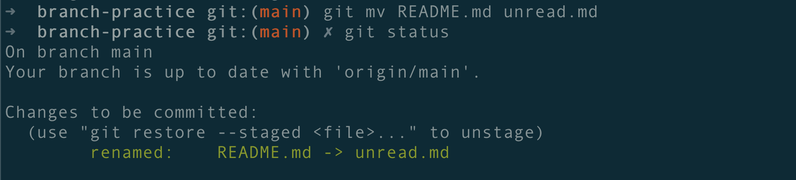

### 회고 : retrospective

스프린트 주기에서 가장 중요한 건 시작할 때 keep off meeting 하는 것 , 끝 날 때 retrospective 하는 것.

3L 전략

Liked: 짧게나마 팀 프로젝트를 경험해보면서 git flow 전략에 따라 브랜치를 따오고 작업하고 병합하는 하나의 사이클을 경험해볼 수 있어서 좋았다.

Learned: git flow에 대한 전체적인 흐름을 배우고 실습을 해보았다.

Lacked: 체득될 때 까지 많은 연습이 필요하다. 깃 명령어에 아직 익숙하지 않은 것 같다.

스프린트 단위로 회고가 정말 중요하다~

### 되돌리기 : Revert

### 이름 바꾸기 : rename

### move의 문제점

shell command에서 move로 이름바꿀 수 있었는데, 이건 위험성이 있음.

깃이 이미 알고있는 파일에 대해 이름을 그냥 바꾸면

mv README.md unread.md

git status

찍어보면

deleted: README.md

Untracked files : unread.md

기존에 존재하던 파일의 이름만 바꿨을 뿐인데, 기존에 tracked 였던 파일이 삭제되었다고 뜨고 untracked에 새로운 파일이 생김.

프로그램 상으로는 기존 파일이 삭제되고 우연히 내용이 같은 파일이 새로 생겼을 뿐이라고 해석해버림.

### 원래로 돌리면 돌아감

mv unread.md README.md

git status

Your branch is up to date …

### 문제 없이 이름 바꾸기

git mv README.md unread.md

### 깃이 알고있는 파일을 옮길 때

마찬가지로 그냥 mv하는 게 아니라 git 명령어를 붙여서 git mv unread.md bin

### 최신 커밋으로 돌아가기

checkout은 구식

### 최신 커밋으로 돌아가기 : restore

git restore .

위 명령어는 현재 wd의 모든 파일의 변경사항을 undo할 수 있음.

### stage에 올린 (add 된) 파일을 되돌리는 법

1. unstaging

   HEAD는 현재 최신의 브랜치

### add, 커밋은 작업단위로 구분해서 해야 함

아래처럼 작업 단위 구분이 안 될 때

작업단위 구분을 위해 unstaging 할 녀석을 git restore HEAD로 내림

git restore —staged <file> 하면 스테이징 되돌리기

git restore <file> 하면 wd 변경사항 되돌리기 가능

### rebase

base를 업데이트하는 것.

git flow는 rebase가 아닌 merge 기반의 전략이다. (merge할 떄 conflict를 일으켜서 머지를 완성)

팀원의 수가 많으면 많을수록 merger 기반 git flow가 좋다.

rebase 방식이라면 n명의 팀원이라면 n번의 rebase를 해야 한다.

### 이미 완료된 `커밋을 ‘수정’`하기

모든 실수는 푸시 전에는 되돌릴 수 있음. 푸시 되고나서는 되돌리기 위해서 아주 많은 리소스가 필요.

`git commit —ammend`

### 이미 완료된 커밋을 ‘취소'하기

1. 흔적 조차 지워버리기
2. 반성의 의미로, 잘못한 이력도 commit으로 박제하고 수정한 이력을 남기기

   → 신뢰의 관점

   

### reset은 하지 마라. rm -rf처럼 머릿속에서 지워라.

git reset —hard와 같은 거 하지말고, 사과를 빠르게 하는게 좋다.

### git commit -m 하지마라. git add . 하지마라.
