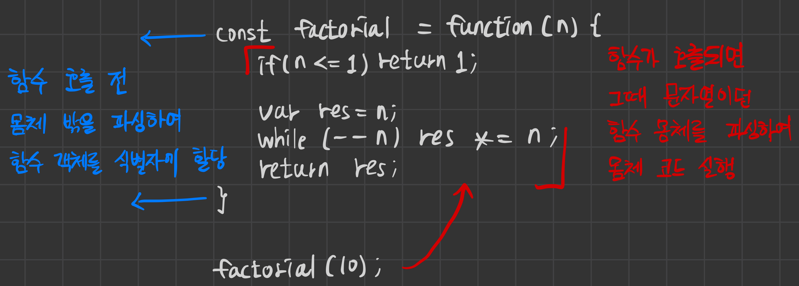

# 20220819금

아스키코드, 유니코드가 뭔지, 왜 쓰는지 알아야 함

식별자 없이 프로퍼티 키로만 값을 참조하는 방법은 없음

## 동적 결정 vs 정적 결정

아래 코드처럼 재귀적으로 객체를 참조할 경우 메소드가 객체에 종속적으로 묶이게 된다. 묶인 객체의 프로퍼티밖에 참조할 수 없다. (정적 결정)

이러한 문제를 해결하기 위해 this는 호출할 때 동적으로 결정된다. (동적 결정)

```jsx
const circle = {
  // 프로퍼티: 객체 고유의 상태 데이터
  radius: 5,
  // 메서드: 상태 데이터를 참조하고 조작하는 동작
  getDiameter() {
    // 이 메서드가 자신이 속한 객체의 프로퍼티나 다른 메서드를 참조하려면
    // 자신이 속한 객체인 circle을 참조할 수 있어야 한다.
    return 2 * circle.radius;
  },
};

console.log(circle.getDiameter()); // 10
```

## 중첩 함수를 만드는 이유

- 외부 함수 내에서만 접근할 수 있도록. 외부 함수에서만 쓸 수 있도록.
- 외부 함수 내에서 재사용 하기 위해

```jsx
function foo() {
  'use strict';

  console.log("foo's this: ", this); // undefined
  function bar() {
    console.log("bar's this: ", this); // undefined
  }
  bar();
}
foo();
```

## 주석은 좋은 것인가

주석은 안 좋다. 부연 설명이 필요한 구린 코드라는 반증이다.

유지보수 측면에서도, 코드를 고치면서 주석도 고쳐야하기 때문에 별로다.

주석을 쓸 필요가 없도록 식별자 이름을 잘 짓자.

## 외부 함수와 내부 함수 this 불일치 문제 해결

- 외부 함수에 const that = this; 선언하고 내부 함수에 that 사용
  → 고전적이지만 효율적이다.
- call, apply, bind로 간접 호출하는 방법
- 하지만 가장 좋은 건 화살표 함수 사용
  → ES6 문법 중에서 가장 고평가되고 많이 사용한다.

## 콜백 함수 vs 중첩 함수

- 콜백 함수는 인수로 받고, 외부의 로직을 내부로 가져온다.
- 중첩 함수는 로직의 일부를 내부에서 고정으로 받는다.

## 매개변수

매개변수는 값을 받아들이는 통로다.

인터페이스는 외부와 내부를 이어주는 통로다.

## setTimeout의 콜백함수

setTimeout 이름 자체의 의미는 타임아웃을 설정한다는 것이지, 콜백 함수를 얘가 호출한다는 얘기는 없다.

브라우저가 타이머를 돌리고 시간이 되면 콜백 함수를 일반 함수로써 호출한다.

## this는 누가 갖는가

- 전역 객체는 this를 갖는다.
- 함수도 this를 갖는다.

## 함수 객체 평가때는 함수 몸체를 모른다.



- 함수 선언문이든, 함수 표현식이든 호출되기 전까지 엔진은 함수 몸체의 식별자 정보조차 모른다.
- 호출이란 함수 객체가 가지고 있는 내부 메서드 [[Call]]을 호출하는 것이다.
- 함수가 호출되면 그때 함수 몸체에 들어가서 ‘문자열이었던' 함수 몸체를 평가하고 실행한다.
