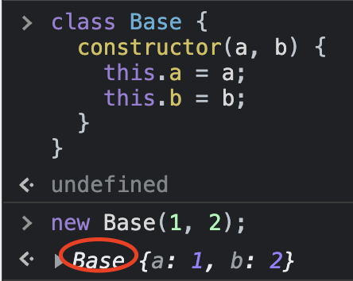
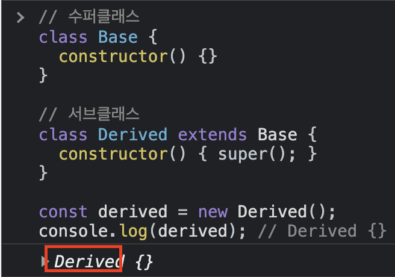

# 20220823화 (1)

## 객체를 어떻게 생성할 것인가

객체 생성 방식 5가지 중, 상황에 따라 적절한 가치판단을 해서 적절한 방식으로 객체를 생성해야 한다. 머릿속에 재료가 빈약하면 맨날 쓰던것만 쓴다. 가장 중요한 건 다양한 문법 중 현재 상황에 맞는 것을 끄집어 내어 쓸 수 있어야 한다.

## 클래스는 프로토타입의 문법적 설탕인가?

문법적 설탕이라고 한다면 문법만 다르고 동작은 동일해야 한다. 하지만 클래스와 생성자 함수는 크게 5가지 차이가 있다. 이 측면에서 클래스는 문법적 설탕이 아니다. 가장 큰 차이는 new를 붙이고 안붙이고의 차이. 클래스는 new 안 붙이면 에러 뜸. 이것 하나만 얘기해도 문법적 설탕이 아니고 다르다.

## ES6 이후의 컨셉을 이해해야 한다

ES6 이전과 이후를 기원전 기원후로 생각한다면, ES6 이후에는 새로운 문법들이 에러를 적극적으로 낸다.

옛날 문법일수록 에러를 안 내려고 노력한다. NaN같은.

## 클래스 vs 생성자 함수

그래서 생성자 함수는 쓸 일이 없다. 클래스 써야 함. 더 엄격하고 간편함.

근데 생성자 함수 왜 배웠냐? 생성자 함수를 알아야 클래스와 비교해서 클래스를 쓴다. 여러가지 경우의 수를 알아야 그 중에 하나를 선택하지.

## 그래서 클래스 언제 쓰나?

예를 들어 자료구조 만들 때. 클래스는 자료구조에 적합하다.

## 자바스크립트는 클래스 기반 언어?

클래스는 생성자 함수의 내부 동작과 동일하다. 생성자 함수는 프로토타입 기반으로 동작한다. 클래스는 프로토타입 기반이니까 결국 자바스크립트는 클래스 기반이 아니고 프로토타입 기반 언어다.

코드를 한 줄을 쓰더라도 한 줄 한 줄 내가 왜 썼는지 설명을 못하면 그건 개발자가 아니다.

정적 메서드에서 this를 쓸 일이 드물지만, 쓴다면 this는 클래스를 가리킨다.

Math 생성자 함수 같은 애들은 this를 안 본다. 수학적인 기능을 하는 정적 메서드들을 모아놓은 생성자 함수..

---



여기서 Base는 {a: 1, b: 2}라는 인스턴스를 만든 생성자 함수 또는 클래스를 가리킨다.



위에서는 실제로 Base가 만든건데, Base가 만들어서 Derived한테 토스해준거다. 그래서 사실은 Base가 만든거지만 마지막에 new로 누구를 호출했냐에 따라 만든놈이 정해진다.

## extends가 구체적으로 하는 일

- 클래스의 프로토타입 체인에 연결
- 인스턴스의 프로토타입 체인에 연결

super를 참조하는 건 그렇게 흔치 않다. 알고만 있어라.

## 클래스는 스코프를 갖지 않는다.

클래스는 생긴건 함수가 아님. 클래스를 가지고 함수를 만들어야 한다. 클래스로 함수를 만들기 위해 constructor 메서드는 클래스가 평가되어 생성한 함수 객체 코드의 일부가 된다. (클래스 자체는 스코프가 없다)

constructor는 메서드로 해석되는게 아니라 클래스가 평가되어 생성한 함수 객체 코드의 일부가 된다고 했는데, 함수 객체 코드의 일부가 되는 시점이 언제인지 알 수 없다.

- new로 호출했을 때 constructor가 함수 객체 코드의 일부가 되는지
- class가 함수 객체로써 평가 되었을 때 이미 constructor는 함수 객체 코드의 일부가 되었는지

알 수 없다.

클래스 몸체에는 메서드만 올 수 있다.

- 클래스 필드도 결국엔 constructor의 인스턴스 프로퍼티다.

```jsx
class Person {
  const a = 1;
}
Uncaught SyntaxError: Unexpected identifier
```

클래스 필드도 constructor의 인스턴스 프로퍼티이므로 클래스 필드에서 정의한 화살표 함수의 this와 인스턴스 메서드로 정의한 화살표 함수의 this는 동일하다.

프로토타입 메서드에서의 this도 마찬가지로 인스턴스를 가리킨다.

```jsx
class Person {
  constructor() {
    this.sayHi = () => console.log('sayHi', this);
  }
  sayBye = () => console.log('sayBye', this);

  sayHello() {
    console.log('sayHello', this);
  }
}

const a = new Person();

a.sayHi();
a.sayBye();
a.sayHello();
```
