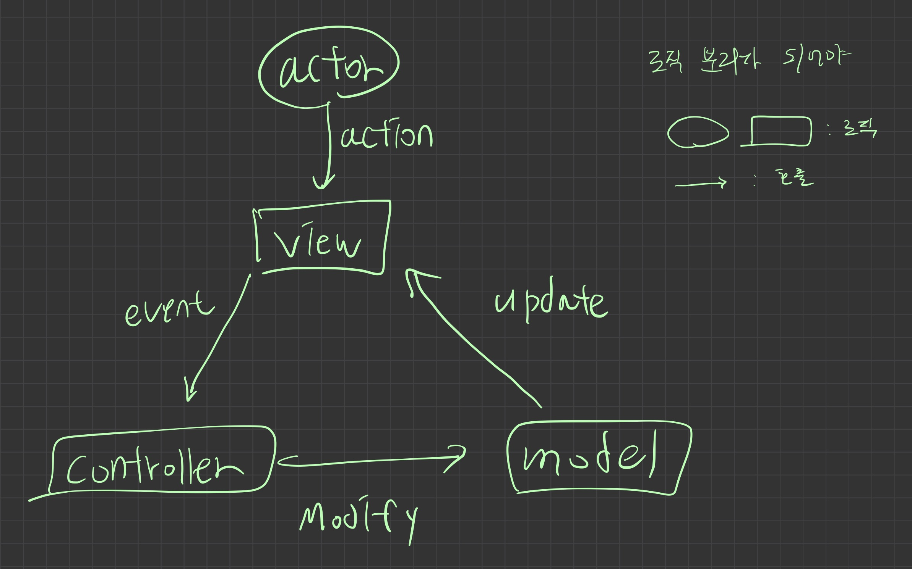

# 8주차 8월29일~9월2일 요약

## 서버로부터 응답받는 리소스는 전압이다.

HTML에 포함된 모든 external 리소스는 서버로부터 랜선을 타고 전압으로 넘어와 바이트 형태(유니코드)로 응답된다.

## 브라우저 렌더링 파트의 핵심은 리플로우와 리페인트

특히 리플로우가 핵심 개념

- layout, reflow는 같은 개념
- 우리가 할 수 있는 일은 리플로우를 최소한으로 줄이기

### 성능은 언제 고려해야 할까

1. 우선은 가독성만 신경쓴다
2. 결과적으로 로딩이 오래(3초)걸리면 그 때 성능을 위해 리팩토링 한다

---

## DOM을 공부하고 느껴야할 것

DOM이 참 불편하구나. 그래서 리액트같은 라이브러리를 써야겠구나.

- DOM이 일관성이 참 없다.
  - textContent, innerText, innerHTML, nodeValue 등

## 이벤트 핸들러 어트리뷰트 방식

이벤트 핸들러 어트리뷰트 방식에서 어트리뷰트 값으로 들어오는 함수 호출문은 “문자열"이다.

- 객체를 넘길 수 없다.
  - 리액트로 하면 {}로 넘기니까 객체 넘길 수 있다. (JSX 문법)
    ```jsx
    <!DOCTYPE html>
    <html>
    <body>
      <button onclick="sayHi('Lee')">Click me!</button>
    위에 이걸 아래처럼 바꾸면 JSX?
      <button onClick={sayHi('Lee')}>Click me!</button>
      <script>
        function sayHi(name) {
          console.log(`Hi! ${name}.`);
        }
      </script>
    </body>
    </html>
    ```

### 이벤트 핸들러 어트리뷰트 방식은 안 좋은가

바닐라 자바스크립트에서는 바람직하지 않다. 하지만 큰 틀에서 CBD 방식으로 보면 옳다.

- 전통적인 관점에서 HTML, CSS, JS는 각각 문법이 다르고 분리된다.
- 현재의 관점은 HTML, CSS, JS는 한 몸이다.
  - 문법은 다르고 분리되어있지만 목적은 동일하다
  - 관심사가 동일하다
    - 컴포넌트를 만든다 (CBD)

전통적 관점에서는 HTML이 대장이었는데, 지금은 JS가 HTML, CSS를 관장한다.

- 리액트에서 HTML 파일을 만들 일이 없다.
  - JS안에서 HTML, CSS 다 작성한다.
  - HTML이 JS안에서 문자열이 되어 존재한다.
    - innerHTML에 할당하는게 문자열임

## 제이쿼리를 쓰지말라는 이유

제이쿼리를 사용하면 자바스크립트가 HTML에 종속된다.

- 자바스크립트 로직은 변화가 없는데 HTML, CSS가 변하게 되는 경우에 문제
  - 디자인이 바뀌었는데 코드에 영향을 주게 됨
    - 테스트를 다시 하게 됨
    - 오류가 발생할 수 있음

아래 $(’h1’)이 querySelector와 같다.

- querySelector가 문제다 HTML에 종속이 되어있다.
- 제이쿼리 쓰지 않아야겠다고 생각했으면 DOM도 사용하면 안 된다.

```jsx
$(function () {
  var title = 'app works!';
  $('h1').text(title);
});
```

최고 좋은 건 디자인이 바뀌더라도 자바스크립트 로직에 변화가 없다는게 확신할 수 있어야 함

HTML이 주도하는 개발 방식에서 JS가 주도하는 개발방식으로 바꿔야 함.

## 이벤트 객체는 언제 생성되는가

이벤트가 발생하면 이벤트 객체가 생성된다. 이벤트는 언제 발생하는가

- 사용자가 뭔가 했을때
- 페이지가 로드되었을 때
- 커스텀 이벤트의 디스패치가 호출되었을 때 등

## 이벤트 리스너는 뭐 하는 녀석인가?

지정된 이벤트 타입을 가지는 요소 노드들에게 이벤트가 발생하는지 관찰하는 메서드

- 이벤트 타입이 다른 노드의 경우에는 관찰하지 않는다.
- 이벤트 리스너가 걸리지 않은 노드도 관찰하지 않는다.

## 공부는 어떻게가 아니라 왜

어떻게 하지? 보다는 왜 안되지? 또는 왜 되지?를 생각하자

---

## 비동기가 무엇인가

명시적으로 함수를 호출하지 않고 브라우저가 호출하는 것

### 비동기는 왜 쓰는가

블로킹을 해결하기 위해

- 블로킹은 콜스택이 싱글스레드라서 발생
  - 멀티스레드로 하면 너무 복잡해짐
  - 싱글스레드로 동시성까지 잡고싶었다
    → 비동기가 등장

## 클라이언트와 서버의 통신 과정

물리적으로 멀리 떨어져있는 서버와 클라이언트의 커뮤니케이션이 필요함.

클라이언트는 서버로부터 HMTL, CSS, JS, 이미지, 폰트, 동영상 등 여러 리소스를 받아야 함.

- 서버가 해당 리소스들을 다 가지고 있고 브라우저가 리소스들을 받아서 화면에 렌더링 함

### HTTP 통신 규약의 필요성

서버에 리소스를 요청할 때 중구난방으로 요청하면 안 됨

- 중구난방의 요청 방법을 다 아는 건 비효율적
- 딱 하나의 규약인 HTTP를 정해서 해당 방식으로 리소스를 주고 받음

### REST API의 필요성

HTTP 통신 규약대로 요청은 하지만 디테일한 컨벤션이 부족

- 원활한 커뮤니케이션을 위한 약속으로 REST API가 나옴

### 에러는 언제 어디서 감지하는 것이 좋을까

발생원(에러가 발생하는 지점)

- 수 백개의 함수의 발생원마다 에러 처리를 고려하기 힘들다
- 에러 처리 방식이 바뀌면 수 백개의 함수에 에러 처리 방식을 다 바꿔야 한다

top level(전역 실행 컨텍스트)

- 에러는 호출자 방향으로 전파된다
- 가장 바깥에서 에러 처리를 하는게 유지보수가 간편하고 모든 에러를 잡을 수 있다.

---

## 에러(error)와 예외(exception)

에러는 단순하게 오류뜨는거고 예외는 우리가 기대한대로 동작하지 않는 것

예외는 NaN같은거.

- 에러를 발생시키지 않으려고
- 1 \* n (알고보니 문자열인 식별자) ⇒ NaN 발생
  - 처음엔 let n = 1 이런 숫자였겠지만, n = ‘a’ 재할당에 의해 1 \* n ⇒ NaN 과 같은 예외가 발생
    - 결국 재할당은 안 좋은 것이다.
  - 변수에 타입이 없어서 발생 (동적 타입)
    - 동적 타입이 위험, 타입스크립트 쓰자
  - 에러가 아닌 NaN은 위험하다. 나도 모르는 곳에서 문제발생 가능
    - 결국 예외보다는 에러가 좋다.
      - 그래야 문제를 빨리 캐치하고 해결 가능

### 에러를 발생시켜라

예외 상황에서 에러를 던지지 않으면 의도치 않은대로 동작하고, 여기서 캐치하지 못하면 나중에 더 큰 문제가 발생

- 예외 상황에서 에러를 던지자.
  - 에러는 구체적일수록 좋다.
    - abc라는 에러가 있다면 에러 생성자 함수를 상속받아서 클래스를 만들든지 해라
- 에러는 호출자 방향으로 전파되므로, 한 곳에서 잡을 수 있다.
- await가 나오면서

## 호출자(caller)란

현재 실행중인 실행 컨텍스트가 caller다

전역에 foo함수가 있고 foo함수 내부에 bar함수가 있으면 bar 함수의 호출자는 foo이고 foo함수의 호출자는 전역이다.

- 비동기의 경우 호출자가 없다.
  - 태스크 큐에서 기다리다가 콜스택이 비었을 때 호출되므로
  - await은 비동기를 동기처럼 쓸 수 있게 해줌
    - 따라서 await과 try catch문을 사용해서 에러를 잡아야 한다.

## 모듈

### 모듈이 없던 시절

자바스크립트는 웹사이트의 보조적인 기능을 위해 태어났으므로 ES5까지는 모듈이 없었다.

- 모듈 없으면 파일 1000개라면 script 1000개 달아줘야 함. + 실행 순서도 맞춰서
- 서로 다른 파일이 동일한 전역 스코프를 공유
  - var로 선언한 전역 변수가 의도치 않게 재할당 되는 문제가 발생

### 모듈 스코프

모듈은 모듈 스코프 혹은 파일 스코프를 가진다.

- 전역이 존재하지 않는다.
- 각각의 모듈은 서로 참조할 수 없다.
- 정보 은닉이 가능하다.

### 모듈은 클로저

```jsx
// 모듈
const a = 1;

const foo = () => {
  console.log(a);
};

export default foo;
```

다른 모듈에서 foo를 가져다 쓰면 foo는 클로저가 된다.

- a는 해당 모듈 내에서만 볼 수 있다.
  - 다른 모듈에서 a를 참조할 수 없다.
  - private과 흡사함

## FE 개발자의 역량

빠른 학습 능력

- 기본기가 탄탄해야 새로 배워도 빨리 배운다.
- 공식 사이트 도큐먼트를 읽어야 한다. (티스토리 X, 벨로그 X)
  - 만든 사람이 쓴 글이다.
  - 진득하게 읽어볼 필요가 있다.
    - 너무 길면 최소한 get started라도 읽어본다.
    - concepts는 꼭 읽어보자
    - 번역기 돌려서라도
  - 최소 5번은 읽어야 한다.

## MVC라는 이름은 중요하지 않다

어떤 하나의 패턴으로 통일한다는게 중요

- 여러 사람이 하나의 통일된 아키텍처를 따르면 생산성이 증가
- 협업의 근본적인 목적은 생산성의 향상
  - 이러한 측면에서 검증된, 통일된 아키텍처를 쓰는게 중요
  - 아키텍처에 대한 이해가 선결되면 프레임워크를 잘 사용할 수 있음
    - ex) 리액트에서 이야기하는 state란 무엇인가
    - ex) 리렌더링이란 무엇인가? 어떻게 구현해야 하는가?
    - 사용법만 익히는건 의미가 없음



액션에 따라 해야 할 일을 컨트롤러가 명확히 ‘시킴’

화살표가 양방향으로 되면 복잡도가 배로 증가함

- 화살표는 함수 호출을 의미.
- event는 event가 발생하면 이벤트핸들러가 호출됨을 의미

컨트롤러는 이벤트 핸들러를 의미

모디파이는 모델을 변경하는 함수를 호출한다는 의미

- ex) addTodo, removeTodo 호출

state(모델): 뷰에 영향을 주는 데이터

모든걸 다 모델로 만들 필요는 없다

- ex) 지역 변수를 다 모델로? X

### 상태 관리

이러한 state들을 관리하는 것을 리액트에서 상태 관리라고 한다.

리액트에서는 state 관리만 하면 알아서 바꿔주고 업데이트하고 리렌더링 알아서 시켜줌
